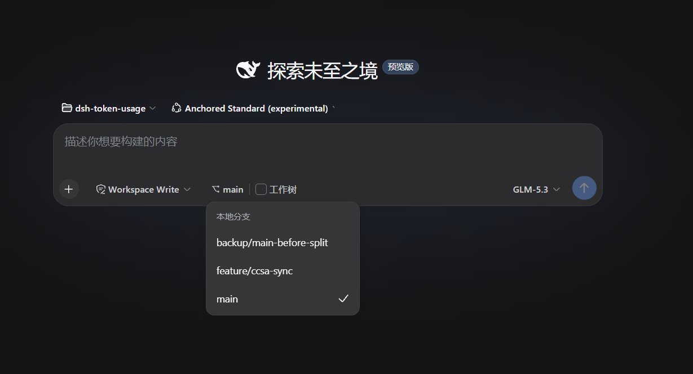

# dsh-git-worktree

[](https://awesome-dsh-plugin.com)



简体中文 | [English](./README.md)

一个 [dsh] 插件：在 Web 界面进行简单的分支与 worktree 管理。输入框工具行显示当前分支 —— 选其他分支原地切换；勾选**「工作树」**则获得一个注册为真实工作区的隔离 worktree，效果见上图。

[dsh]: https://github.com/cordiverse/dsh

仓库：<https://github.com/LaoYueHanNi/dsh-git-worktree>

> [!IMPORTANT]
> **从 0.3.2 及更早的 GitHub 直装升级？** 0.4.0 起插件发布到 npm，包名变更为 `@laoyuehanni/dsh-git-worktree`（原裸名在 npm 上已被第三方占用）。旧的 `github:` 安装**无法通过 `update` 升级**——包名已变，原地 update 会导致插件加载失败。从 0.4.0 开始使用，需先移除旧包名，再重新安装：
>
> ```sh
> dsh plugin --profile web remove dsh-git-worktree
> dsh plugin --profile web add @laoyuehanni/dsh-git-worktree
> ```
>
> 迁移不影响数据：`~/.dsh/gitworktree/` 下的 worktree 目录与插件设置完整保留。

## 功能

- **IDEA 风格分支选择器**：分支菜单把 `/` 视为文件夹层级 —— 可折叠文件夹、末段标签，当前分支所在链路默认展开并居中。单击选中（蓝底），双击或 Enter 弹出右侧确认弹层。左侧工具栏提供**定位当前分支**与**全部展开/折叠**；底部搜索保留匹配分支的祖先文件夹并高亮命中字符；超长标签悬停显示全名。
- **分支切换**：从 chip 菜单选分支、确认后原地 `git switch`。在 worktree 会话内只作用于该 worktree。
- **工作树隔离**：空白会话上勾选**「工作树」**立即在 chip 上方弹出「从当前分支切出」确认弹窗——确认后从当前检出切出**新分支**（`<当前分支>-wt`，重名自动递增 `-wt2`、`-wt3`…）并隔离到全新 worktree；分支 chip 的菜单仍可打开，选其他分支则在 `~/.dsh/gitworktree/<仓库>-<分支>/` 下执行 `git worktree add`。两条路径都会注册为真实工作区并跳转到新目录的空白会话。重复选同一分支直接复用；失效注册自动 prune 恢复。取消确认弹窗后直接发消息，即默许在当前目录开始会话。
- **存放根路径可配**：**设置 → 插件**页签下的 **Git 工作树** 卡片 —— 原生目录选择器或手输绝对路径，保存即生效（新建的 worktree 落在新目录，已有的留在原地，git 仍能识别复用）。留空使用默认 `$DSH_HOME/gitworktree`（`~/.dsh/gitworktree`）。设置存于 dsh 统一设置文档；旧版 `~/.dsh/git-work-tree/settings.json` 的已保存值会在升级后自动迁入（原文件改名 `.migrated` 保留）。

## 安装

### 从 npm 安装

```sh
dsh plugin --profile web add @laoyuehanni/dsh-git-worktree
```

> 包声明了 `dsh.bundle`，`add` 会自动把插件挂进 profile 的层栈，无需手动改配置。编译产物 `lib/` 随 npm 包分发，安装开箱即用，无需任何构建步骤。需要 `web` profile（`dsh web`）。

### 从本地目录安装（开发调试用）

```sh
dsh plugin --profile web add link:D:/Code/dsh-worktree
```

`link:` 安装的是符号链接：重新构建插件后重启 `dsh web` 即可生效。

## 更新

```sh
dsh plugin --profile web update @laoyuehanni/dsh-git-worktree
```

## 移除

```sh
dsh plugin --profile web remove @laoyuehanni/dsh-git-worktree
```

插件会从 profile 移除并停止加载。`~/.dsh/gitworktree/` 下的 worktree 目录会保留；已迁移的旧设置文件（`settings.json.migrated`）如不需要可手动删除，插件自身的设置项存于 dsh 设置文档。

## 开发

先构建一次插件：

```sh
npm install
npm run build && npm run build:client
npm test                # vitest（60 项测试）
node scripts/smoke.mjs  # 基于构建产物的真实 git 冒烟
```

> **刻意不设 `prepare` 脚本。** 编译产物 `lib/` 已提交进仓库，并随 npm 包分发。pnpm ≥ 10 默认拒绝执行依赖的构建脚本，除非加入白名单，因此若保留 `prepare`，pnpm 用户的安装会出现被跳过或失败的步骤。改为分发预构建产物后，`dsh plugin add @laoyuehanni/dsh-git-worktree` 才能开箱即用。**改动 `src/` 下的任何文件后，务必重新构建并提交更新后的 `lib/`**（并发布新版本），否则别人安装到的是旧产物：

```sh
npm run build && npm run build:client
git add lib/
```

临时挂载 —— 仅当次启动生效，不动 profile。在仓库旁建一个 `cordis.yml` 指向构建出的 host 半边（Windows 需要 `file:///` 形式）：

```yml
- insert:
    - id: git-worktree
      name: 'file:///D:/Code/dsh-worktree/lib/index.js'
```

```sh
dsh web --patch <插件目录>/cordis.yml
```

此模式只挂载 host 半边（`/plugin/git-worktree/*` 三条路由照常工作）；分支 chip 依赖按包名解析的客户端 bundle，因此开发 UI 请用上面的 `link:` 安装方式：执行 `npm run build && npm run build:client`（或在插件目录跑 `npx tsdown --watch`）并重启 `dsh web` 后，浏览器端插件会自动热重载。
